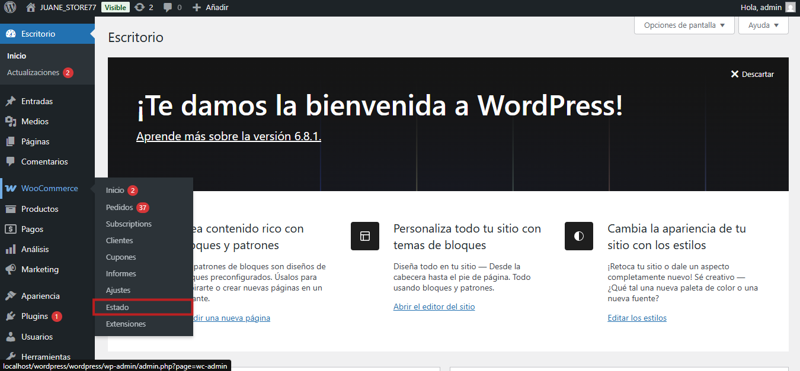
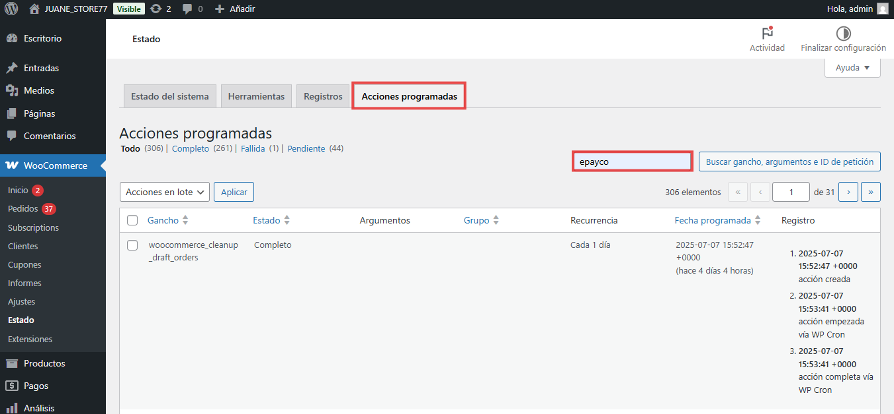
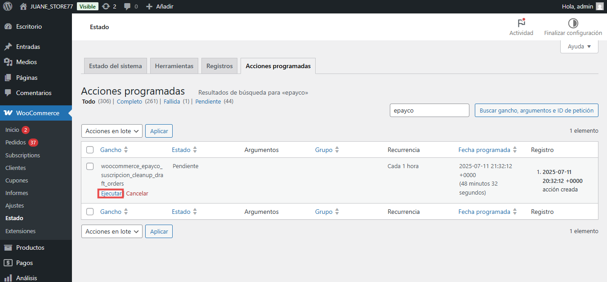
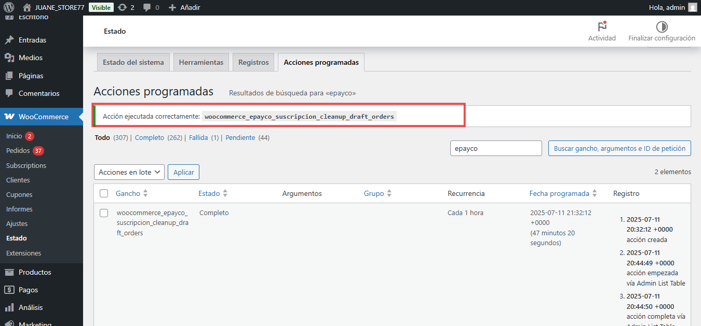

# ePayco Subscriptions for WooCommerce

**Si usted tiene alguna pregunta o problema, no dude en ponerse en contacto con nuestro soporte técnico: desarrollo@payco.co.**

## Tabla de contenido

* [Requisitos](#requisitos)
* [Instalación](#instalación)
* [Pasos](#pasos)
* [Versiones](#versiones)

## Requisitos

* Tener una cuenta activa en [ePayco](https://pagaycobra.com).
* Tener instalado WordPress versión 5.3.x o superior.
* WooCommerce versión 7.7.0 =>.
* WooCommerce Suscripcion versión 2.6.x o superior.
* WooComerce pago en bloques.
* Acceso a las carpetas donde se encuetra instalado WordPress y WooCommerce.
* Acceso al admin de WordPress.

## Instalación

1. [Descarga el plugin.](https://github.com/epayco/suscripciones_woocommerce#versiones)
2. Ingresa al administrador de tu wordPress.
3. Ingresa a Plugins / Añadir-Nuevo / Subir-Plugin. 
4. Busca el plugin descargado en tu equipo y súbelo como cualquier otro archivo.
5. Después de instalar el .zip lo puedes ver en la lista de plugins instalados , puedes activarlo o desactivarlo.
6. Para configurar el plugin debes ir a: WooCommerce / Ajustes / Pagos y Ubica la pestaña Suscripciones ePayco.
7. Configura el plugin ingresando el **P_CUST_ID_CLIENTE**,**P_KEY**, **PRIVATE_KEY**,**PUBLIC_KEY** , los puedes ver en tu [panel de clientes](https://dashboard.epayco.com/configuration).
9. Selecciona o crea una página de respuesta donde el usuario será devuelto después de finalizar la compra (por defecto el sistema redirecciona a la pagina de gracias de Woocommerce).
10. Configurar los productos en el panel de Wordpress:  WooCommerce / Productos
 con los respectivos valores para la suscripcion.
11. Realiza una o varias compras para comprobar que todo esté bien.
12. Si todo está bien recuerda cambiar la variable Modo Prueba a NO y empieza a recibir pagos de forma instantánea y segura con ePayco.
13. Tener en cuenta que para la cancelación de la suscripciones se debe de realizar por medio del [dashboard](https://dashboard.epayco.co/login) donde encontrar la información de la suscripcion y podra realizar la cancelación de esta.

## Tarea programada para realizar las actualizaciones del estado de las suscripciones 

Configuracion automatica:
1. Debes ir a: WooCommerce / Ajustes / Pagos y Ubica la pestaña Suscripciones ePayco.
2. Elije en que tiempo deseas que se ejecute el cron, 30 o 60 segundos.
3. Guardar los cambios.

Configuración manual:
1. Ingresa al administrador de tu WordPress.
2. Ingresa a WooCommerce / Estado / Acciones programadas. 
3. Busca por gancho, argumentos e ID de petición y agrega el nombre de ePayco.
4. Aparecerá la tarea programada con el nombre (woocommerce_epayco_suscripción_cleanup_draft_orders) y haz clic en Ejecutar. 
5. Te aparecerá un mensaje de confirmación diciéndote que la tarea programada se ejecutó correctamente. 
6. Con estos pasos anteriores los estados de tu suscripción se actualizarán correctamente, manteniendo así sincronizado el estado de la suscripción en tu dashboard de ePayco con el estado de tus suscripciones en WooCommerce. 

## Pasos

## Pasos para ejecutar la Acción programada

## Versiones
* [ePayco plugin WooCommerce v6.5.2](https://github.com/epayco/suscripciones_woocommerce/releases/tag/v6.5.2)
* [ePayco plugin WooCommerce v6.5.1](https://github.com/epayco/suscripciones_woocommerce/releases/tag/v6.5.1)
* [ePayco plugin WooCommerce v6.5.0](https://github.com/epayco/suscripciones_woocommerce/releases/tag/v6.5.0)
* [ePayco plugin WooCommerce v6.4.4](https://github.com/epayco/suscripciones_woocommerce/releases/tag/v6.4.4)
* [ePayco plugin WooCommerce v6.4.3](https://github.com/epayco/suscripciones_woocommerce/releases/tag/v6.4.3)
* [ePayco plugin WooCommerce v6.4.2](https://github.com/epayco/suscripciones_woocommerce/releases/tag/v6.4.2)
* [ePayco plugin WooCommerce v6.4](https://github.com/epayco/suscripciones_woocommerce/releases/tag/v6.4)
* [ePayco plugin WooCommerce v6.3](https://github.com/epayco/suscripciones_woocommerce/releases/tag/v6.3)
* [ePayco plugin WooCommerce v6.2](https://github.com/epayco/suscripciones_woocommerce/releases/tag/v6.2)
* [ePayco plugin WooCommerce v6.1](https://github.com/epayco/suscripciones_woocommerce/releases/tag/v6.1)
* [ePayco plugin WooCommerce v6.0](https://github.com/epayco/suscripciones_woocommerce/releases/tag/v6.0)
* [ePayco plugin WooCommerce v5.2](https://github.com/epayco/suscripciones_woocommerce/releases/tag/v5.2)
* [ePayco plugin WooCommerce v5.1](https://github.com/epayco/suscripciones_woocommerce/releases/tag/v5.1)
* [ePayco plugin WooCommerce v5.0](https://github.com/epayco/suscripciones_woocommerce/releases/tag/v5.0)
* [ePayco plugin WooCommerce v4.9](https://github.com/epayco/suscripciones_woocommerce/releases/tag/v4.9).
* [ePayco plugin WooCommerce v4.3](https://github.com/epayco/suscripciones_woocommerce/releases/tag/v4.3).
* [ePayco plugin WooCommerce v4.x](https://github.com/epayco/suscripciones_woocommerce/releases/tag/v4.x).
* [ePayco plugin WooCommerce v3.9.x](https://github.com/epayco/suscripciones_woocommerce/releases/tag/v2.6).
